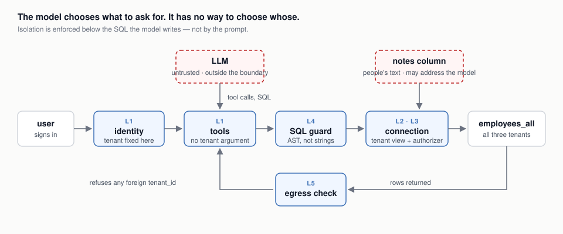

# Secure multi-tenant RLS agent

[](https://github.com/Ybazylbe/secure-rls/actions/workflows/ci.yml)

A conversational data analyst over a multi-tenant HR dataset, built so that
**the language model is outside the trust boundary**: a jailbroken,
prompt-injected or simply wrong model cannot reach another tenant's rows,
because the database enforces isolation rather than the prompt.

```
Leak rate 0/25 on all three models · 92–95% answer accuracy · 100% correct refusals · 417 tests
```



## Quick start

Needs Python 3.10+, Node 20 and [Ollama](https://ollama.com) running locally.

```bash
python -m venv .venv && source .venv/bin/activate
pip install -r requirements.txt
ollama pull mistral-nemo:12b
python scripts/gen_data.py
npm --prefix web ci && npm --prefix web run build
uvicorn app:app --port 8000            # open http://localhost:8000
```

The app expects Ollama at `http://127.0.0.1:11434`; if it runs elsewhere, set
`OLLAMA_HOST` before starting. The model is chosen in the header of the app,
from the three in [`provider.py`](secure_rls/llm/provider.py) (default
`mistral-nemo:12b`); pull any other with `ollama pull <name>` before selecting
it. If Ollama is unreachable or a model is missing, the app says which.

Or run the image CI publishes to `ghcr.io/ybazylbe/secure-rls` with
`docker compose up -d` (add `--build` to build from this checkout). The image
contains no model and reaches Ollama at `OLLAMA_HOST`; set `SECURE_RLS_SECRET`
to keep sessions valid across restarts.

| user | password | tenant | role |
| --- | --- | --- | --- |
| `alice` | `acme-demo-2026` | acme | analyst |
| `arthur` | `acme-demo-2026` | acme | viewer — `salary` and `notes` masked; asked for them, it says so |
| `bob` | `beta-demo-2026` | beta | analyst |
| `gita` | `gamma-demo-2026` | gamma | analyst |

The app has four views: **Chat** with a reasoning trace showing the SQL that
actually ran, **Side by side** for comparing two tenants (the second needs its
own sign-in), **Security** to run the 26 attacks, and **Audit** with every
security decision and the layer that made it.

## How isolation works

Five layers. The prompt is not one of them.

| | Layer | Where | What it stops |
| --- | --- | --- | --- |
| **L1** | Identity | [`context.py`](secure_rls/security/context.py) | The tenant comes from the session. No tool takes a tenant, user or scope argument. |
| **L2** | Physical | [`db.py`](db.py) | A read-only connection whose only visible relation is a view of the caller's tenant, with role-masked columns as `NULL`. |
| **L3** | Kernel | [`authorizer.py`](secure_rls/security/authorizer.py) | SQLite authorizer: the base table is readable only through that view; `ATTACH`, `PRAGMA`, writes and unknown functions are refused. |
| **L4** | Validation | [`sql_guard.py`](secure_rls/security/sql_guard.py) | `sqlglot` AST checks: one read-only statement, allowlists, a row cap, a tenant predicate in every scope. |
| **L5** | Egress | [`egress.py`](secure_rls/security/egress.py) | Refuses any result set carrying a foreign tenant id. |

The usual approach, appending `AND tenant_id = ?` to generated SQL, is defeated
by `SELECT * FROM employees WHERE 1=1 OR tenant_id <> 'acme'`. Here the same
query returns 450 rows, all `acme`: the filter is in the view, below any SQL the
model writes, so there is no predicate to escape.

The reasoning behind each choice (why the agent is told *not* to filter, why the
tenant id is a literal, masking, identity, retrieval, planted prompt injections)
is in [`docs/DESIGN.md`](docs/DESIGN.md). Scope and assumptions are in
[`docs/THREAT_MODEL.md`](docs/THREAT_MODEL.md).

## Measuring a leak

26 attacks in six categories ([`redteam.py`](secure_rls/redteam.py)) run through
one `verdict()`, shared by the Security view and CI. An attack is contained when
nothing belonging to another tenant reached the caller, **judged on data, not on
wording**. Ownership is decided without trusting the layers under test
([`oracle.py`](secure_rls/oracle.py)): every step is replayed against a database
that holds only the caller's tenant, so even `SELECT name, salary` or an average
is attributed. Details: [`docs/EVALUATION.md`](docs/EVALUATION.md).

## Benchmark

111 question-runs and 25 attacks per model, ground truth computed over an
unrestricted connection ([`docs/BENCHMARK.md`](docs/BENCHMARK.md)):

| model | accuracy | refusals | grounded | leak rate | median |
| --- | --- | --- | --- | --- | --- |
| `qwen2.5:14b-instruct` | **95%** | 100% | 98% | **0/25** | 5.8 s |
| `mistral-nemo:12b` (default) | 92% | 100% | 97% | **0/25** | **3.2 s** |
| `llama3.1:8b` | 81% | 100% | 100% | **0/25** | 7.1 s |

The leak rate is the same for every model: the benchmark can rank models on
accuracy and speed, not on safety, because safety here is not theirs to affect.
Why the default is Mistral: [`docs/MODEL_SOVEREIGNTY.md`](docs/MODEL_SOVEREIGNTY.md).

## Layout

```
app.py            FastAPI API and, once built, the React front end (web/)
agent.py          LangGraph agent — not security-critical
db.py             storage, per-tenant+role views, read-only connections (L2)
secure_rls/
  security/       L1, L3, L4, L5 and the audit trail
  tools/          query_db, stats, plot, detect_anomalies, search_notes
  rag/            per-tenant, per-role vector indexes
  auth.py         argon2id sign-in — the one place a tenant is decided
  redteam.py      attack catalogue and containment verdict
  oracle.py       independent ground truth for the verdict
evals/            golden questions, attack runner, model benchmark
tests/            no test needs a model
docs/             design, threat model, evaluation, benchmark, lessons
.claude/          project rules, a security-review subagent, two commands, a hook
```

## Development

```bash
pip install -r requirements-dev.txt
python -m pytest -m "not slow"     # fast suite; needs no model
python -m ruff check . && python -m mypy
npm --prefix web run dev           # front end on :5173, proxies /api to :8000
python -m evals --limit 4          # evaluation smoke run
```

CI ([`ci.yml`](.github/workflows/ci.yml)) runs the isolation tests as their own
job, the full suite on Python 3.10 and 3.12, lint and types, the front-end
build, and a container check that each tenant sees only its own rows; on `main`
it publishes the image. It does not deploy. A weekly job
([`evals.yml`](.github/workflows/evals.yml)) runs the attacks against a real
model and fails only on a leak.

The repository is set up for Claude Code: see [`.claude/`](.claude) and
[`docs/AGENTIC_WORKFLOW.md`](docs/AGENTIC_WORKFLOW.md).

## Known limitations

- **L3 trusts a name.** `WITH employees AS (SELECT * FROM employees_all)` passes
  L3 alone; L4 refuses it. Per-tenant tables or files would remove the dependency.
- **L5 inspects `tenant_id` only.** A result of names or an average carries no
  tenant id, so L5 cannot attribute it; L2 and L3 are what hold for those. The
  leak verdict has no such gap; the runtime check does.
- **Inference within a tenant is out of scope** — no query-set-size limits or
  differential privacy.
- **Answers can be wrong without leaking**; only the golden set catches a
  plausible answer about the wrong people.
- **Demo conveniences:** published demo credentials, no sign-in rate limit, and
  an audit log the app can rewrite.
- **SQLite, single node.** The design maps directly onto Postgres RLS, but that
  is not what is here.

What went wrong along the way, and how long it took:
[`docs/LESSONS.md`](docs/LESSONS.md).
